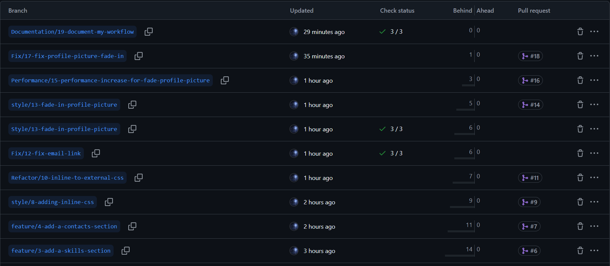
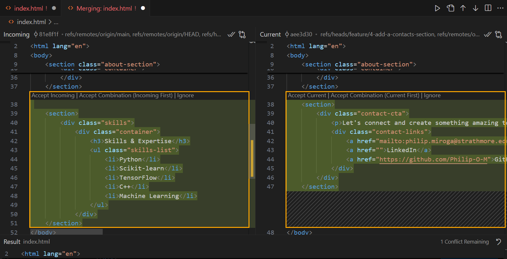

# Personal Portfolio Documentation

## 1. Student Details

- **Full Name**: Philip Miroga
- **GitHub Username**:Philip-O-M
- **Email**:philip.miroga@strathmore.edu

## 2. Deployed Portfolio Link

- **GitHub Pages URL**:  
(https://is-project-4th-year.github.io/build-your-portfolio-github-workflow-essentials-Philip-O-M/)

## 3. Learnings from the Git Crash Program

List at least **four key concepts or skills** you learned during the Git crash course. For each one, write a brief explanation of how it helped you manage your portfolio project more effectively.

- **Commit Messages**: They taught me how to write clear and descriptive commit messages, making it easier to track changes.

- **Merging**: It showed me how to combine changes from different branches safely. 

- **Creating Milestones**: It helped me break the project into phases with clear goals. 

- **Using Labels and Issues**: Enabled better project management by categorizing tasks and bugs. Issues helped me split my milestones effectively while labels helped me manage my issues well.
## 4. Screenshots of Key GitHub Features

### A. Milestones and Issues

- Screenshot showing your milestone(s) and the issues linked to it.

- All milestones

---
---
- Example of issues linked to one of the milestones

### B. Project Board

- Screenshot of your GitHub Project Board with issues organized into columns (e.g., To Do, In Progress, Done).

### C. Branching

- Screenshot showing your branch list with meaningful naming.

### D. Pull Requests

- Screenshot of a pull request that’s either open or merged and linked to a related issue.
- Pull request linked to issue #17

---
---

- Issue linked to pull request #18

### E. Merge Conflict Resolution

- Screenshot of a resolved merge conflict (in a pull request, commit history, or your local terminal/GitHub Desktop).
- Merge conflict occuring 

---
---
- Resolving the merge conflict

---
---
- Resolved merge conflict

